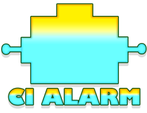
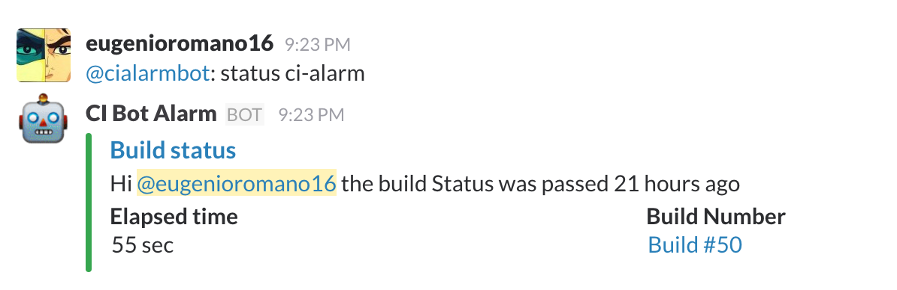
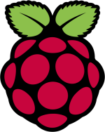

<h1 align="center">Ci Alarm</h1>
<p align="center">
  
</p>
<p align="center">
  <a title='Build Status' href="https://travis-ci.org/eromano/ci-alarm">
    
  </a>
  <a href='https://coveralls.io/r/eromano/ci-alarm'>
    
  </a>
    <a href='https://github.com/eromano/ci-alarm/blob/master/LICENSE'>
      
    </a>
</p>

## About Ci-alarm
Ci-alarm is a  node.js slack bot to help you to communicate with Travis CI.

With this bot you can :
* Get in yor slack chat all the info about your repository
* Restart Build
* Turn on a light alarm through GPIO of the Raspberry Pi when your Travis build fail

## Command list

* To show the command list

    ```@BotName command list ```
<p align="left" >
  
</p>

* To show the repository status
    ```@BotName status "[repository name|repository slugName]" ```
<p align="left" >
  
</p>

* To show the repository list
    ```@BotName repository list ```
<p align="left"  >
  
</p>

    ```@BotName rebuild "[repository name|repository slugName]" ```

    ```@BotName history "[repository name|repository slugName]" ```

    ```@BotName info "[repository name|repository slugName]" ```


## Development

* To test ci-alarm

    ```$ npm run-script test```

* To debug ci-alarm

    ```$ npm run-script debug```

* To see the test coverage ci-alarm

    ```$ npm run-script coverage```

* To run ci-alarm on your machine

    ```$ npm run-script start```

## Plug-In
Ci Alarm is also able to turn on/off a alarm light when the build is failing.
In order to have this kind of plug-in you have to install ci-alarm on a Raspberry PI.
All the specification for this kind of configuration are [here](https://github.com/eromano/ci-alarm/blob/master/doc/README.md).

<p align="left"  >
  
</p>

## Contributing

1. Fork it!
2. Create your feature branch: `git checkout -b ci-alarm`
3. Commit your changes: `git commit -a `
4. Push to the branch: `git push origin ci-alarm`
5. Submit a pull request

## History

For detailed changelog, check [Releases](https://github.com/eromano/ci-alarm/releases).

### Contributors

Contributor | GitHub profile | Twitter profile |
--- | --- | ---
Eugenio Romano (Creator) | [eromano](https://github.com/eromano) | [@RomanoEugenio](https://twitter.com/RomanoEugenio)

