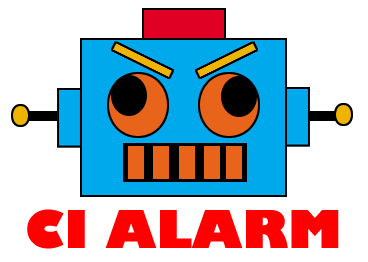

<h1 align="center">Ci Alarm</h1>
<p align="center">
  
</p>
<p align="center">
  <a title='Build Status' href="https://travis-ci.org/eromano/ci-alarm">
    
  </a>
  <a href='https://coveralls.io/r/eromano/ci-alarm'>
    
  </a>
    <a href='https://github.com/eromano/ci-alarm/blob/master/LICENSE'>
      
    </a>
</p>

## About Ci-alarm
Ci-alarm is a simple node.js slack bot to help to turn on a light alarm through GPIO of the Raspberry Pi when your Travis or Jenkins build fail

## Development

* To test ci-alarm

    ```$ npm run-script test```

* To debug ci-alarm

    ```$ npm run-script debug```

* To see the test coverage ci-alarm

    ```$ npm run-script coverage```

* To run ci-alarm on your machine

    ```$ npm run-script start```

## Contributing

1. Fork it!
2. Create your feature branch: `git checkout -b ci-alarm`
3. Commit your changes: `git commit -a `
4. Push to the branch: `git push origin ci-alarm`
5. Submit a pull request

## History

For detailed changelog, check [Releases](https://github.com/eromano/ci-alarm/releases).

### Contributors

Contributor | GitHub profile | Twitter profile |
--- | --- | ---
Eugenio Romano (Creator) | [eromano](https://github.com/eromano) | [@RomanoEugenio](https://twitter.com/RomanoEugenio)

